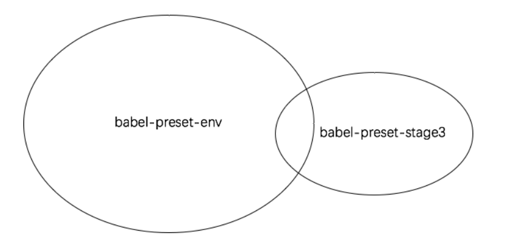
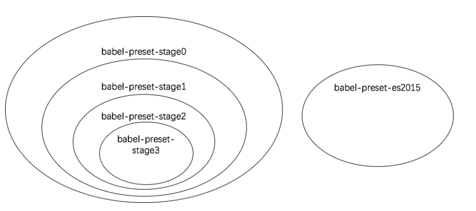

### babel-loader
#### 配置API
- 可以使用options配置presets以及plugins
- 其他options
    - `cacheDirectory`：默认值为 false。当有设置时，指定的目录将用来缓存 loader 的执行结果,
      之后的 webpack 构建，将会尝试读取缓存，来避免在每次执行时，可能产生的、高性能消耗的 Babel 重新编译过程。
      loader 将使用默认的缓存目录 **node_modules/.cache/babel-loader**，如果在任何根目录下都没有找到 node_modules 目录，
      将会降级回退到操作系统默认的临时文件目录
    - `cacheIdentifier`：默认是一个由 babel-core 版本号，babel-loader 版本号，
      .babelrc 文件内容（存在的情况下），环境变量 BABEL_ENV 的值（没有时降级到 NODE_ENV）组成的字符串
    - `forceEnv`：默认将解析 BABEL_ENV 然后是 NODE_ENV
- sourceMap 选项是被忽略的。当 webpack 配置了 sourceMap 时（通过 devtool 配置选项），将会自动生成 sourceMap

#### 源码主要内容
- 核心还是使用了babel的transfrom方法
```
    const transform = promisify(babel.transform);
    result = await transform(source, options);
    const { ast, code, map, metadata, sourceType } = result;
    return { ast, code, map, metadata, sourceType };
```
- 异步callback
```
    const callback = this.async();

    loader
      .call(this, source, inputSourceMap, overrides)
      .then(args => callback(null, ...args), err => callback(err));
```
- 外部配置依赖
```
    if (typeof config.babelrc === "string") {
       this.addDependency(config.babelrc);
    }
```
- 其他
    - cacheDirectory为true,有一个cache方法会读取或生成缓存，对于项目提速有很大帮助，会将转译的结果缓存到文件系统中
    ```
      const filename = function(source, identifier, options) {
          const hash = crypto.createHash("md4");
          const contents = JSON.stringify({ source, options, identifier });
          hash.update(contents);
          return hash.digest("hex") + ".json";
      };
      const file = path.join(directory, filename(source, cacheIdentifier, options))
      return await read(file, cacheCompression);
      //如果错误，转换资源，并写入缓存
      const result = await transform(source, options);
      await write(file, cacheCompression, result);
      return result;
    ```
    - 错误抛出应用了Error.captureStackTrace，V8方法，隐藏调用栈

********

### babel
#### preset：一组插件
```
    //babel-preset-stage0
    "use strict";

    exports.__esModule = true;

    var _babelPresetStage = require("babel-preset-stage-1");
    var _babelPresetStage2 = _interopRequireDefault(_babelPresetStage);

    var _babelPluginTransformDoExpressions = require("babel-plugin-transform-do-expressions");
    var _babelPluginTransformDoExpressions2 = _interopRequireDefault(_babelPluginTransformDoExpressions);

    var _babelPluginTransformFunctionBind = require("babel-plugin-transform-function-bind");
    var _babelPluginTransformFunctionBind2 = _interopRequireDefault(_babelPluginTransformFunctionBind);

    function _interopRequireDefault(obj) { return obj && obj.__esModule ? obj : { default: obj }; }

    exports.default = {
      presets: [_babelPresetStage2.default],
      plugins: [_babelPluginTransformDoExpressions2.default, _babelPluginTransformFunctionBind2.default]
    };

    module.exports = exports["default"];
```
常用preset:
1. babel-preset-env都有那些plugin？

```
babel-preset-env = babel-preset-es2015 + babel-preset-es2016 + babel-preset-es2017
babel-preset-stage3 = babel-preset-es2016 + babel-preset-es2017 + 2个其他plugin
babel-preset-es2016 = "babel-plugin-transform-exponentiation-operator"
babel-preset-es2017 = "babel-plugin-transform-async-to-generator" + "babel-plugin-syntax-trailing-function-commas"
```
到了babelV6之后，弃用babel-preset-es2015，建议用babel-preset-env替代<br/>
在没有配置项的情况下，babel-preset-env表现的同babel-preset-latest一样<br/>
<br/>
优势：可以根据配置的options动态处理转码
<br/>

2. babel-preset-stageX都有哪些plugin?

stage-x是根据JavaScript的提案阶段区分的，一共有5个阶段
    - Stage 0 - Strawman（展示阶段）
    - Stage 1 - Proposal（征求意见阶段）
    - Stage 2 - Draft（草案阶段）
    - Stage 3 - Candidate（候选人阶段）
    - Stage 4 - Finished（定案阶段）
一个提案只要能进入 Stage 2，就差不多肯定会包括在以后的正式标准里面

3. babel-preset-latest
```
babel-preset-latest = babel-preset-es2015 + babel-preset-es2016 + babel-preset-es2017
```
在没有配置项的情况下，babel-preset-env表现的同babel-preset-latest一样

4. babel-preset-react
加入了flow，jsx等语法，与上面几个没有交集

#### plugin:插件
规则
- Plugins run before Presets
- Plugin ordering is first to last
- Preset ordering is reversed (last to first)：确保向后兼容性，因为大多数用户在“stage-0”之前列出了“es2015”

#### [插件手册](https://github.com/jamiebuilds/babel-handbook/blob/master/translations/zh-Hans/plugin-handbook.md)
##### babel的处理步骤
- 解析（parse）：接收代码并输出 AST ，词法分析+语法分析
- 转换（transform）：接收 AST 并对其进行遍历，在此过程中对节点进行添加、更新及移除等操作，插件将要介入工作的部分，核心
- 生成（generate）：把最终（经过一系列转换之后）的 AST 转换成字符串形式的代码，同时还会创建源码映射（source maps）

##### AST [抽象语法树](https://segmentfault.com/a/1190000016231512)
```
    function square(n) {
      return n * n;
    }
```
这个程序最后被表示成如下的一棵树：
```
    - FunctionDeclaration:
      - id:
        - Identifier:
          - name: square
      - params [1]
        - Identifier
          - name: n
      - body:
        - BlockStatement
          - body [1]
            - ReturnStatement
              - argument
                - BinaryExpression
                  - operator: *
                  - left
                    - Identifier
                      - name: n
                  - right
                    - Identifier
                      - name: n
```
或是如下的对象：
```
    {
      type: "FunctionDeclaration",
      id: {
        type: "Identifier",
        name: "square"
      },
      params: [{
        type: "Identifier",
        name: "n"
      }],
      body: {
        type: "BlockStatement",
        body: [{
          type: "ReturnStatement",
          argument: {
            type: "BinaryExpression",
            operator: "*",
            left: {
              type: "Identifier",
              name: "n"
            },
            right: {
              type: "Identifier",
              name: "n"
            }
          }
        }]
      }
    }
```
这样的每一层结构也被叫做 节点（Node）。 一个 AST 可以由单一的节点或是成百上千个节点构成。 它们组合在一起可以描述用于静态分析的程序语法。

##### 访问者模式
- 访问者是一个用于 AST 遍历的跨语言的模式。
- babel使用一种 访问者模式 来遍历整棵语法树，即遍历进入到每一个Node节点时，可以说我们在「访问」这个节点。
- 访问者就是一个对象，定义了在一个树状结构中获取具体节点的方法。
- 简单来说，我们可以在访问者中，使用Node的type来定义一个hook函数，每一次遍历到对应type的Node时，hook函数就会被触发，
我们可以在这个hook函数中，修改、查看、替换、删除这个节点


